# JobForge

> **An asynchronous background job processing system built with Express.js
> and Redis.**

<p align="center">


</p>

---

## Overview

Many backend operations — sending emails, processing payments, generating reports, transcoding video — take too long to run safely inside a single HTTP request. JobForge implements the usual alternative: an Express API that only creates jobs, and separate worker processes that consume and execute them.

The project was built incrementally rather than assembled from a finished design. Each stage starts with the simplest version that works, runs into a specific limitation, and evolves in response — a JavaScript array becomes a Redis List, a polling loop becomes a blocking pop, an immediate retry becomes a delayed one, a discarded failure becomes a dead-lettered one. The goal throughout was understanding why systems like BullMQ, RabbitMQ, SQS, and Kafka are built the way they are, not reproducing them.

---

## Repository Highlights

- Redis-backed FIFO job queue with dedicated worker processes
- Producer–consumer architecture — the API never processes jobs directly
- Automatic retries with a configurable limit
- Delayed retry scheduling via a dedicated scheduler process
- Dead Letter Queue for permanently failed jobs
- Manual replay of failed jobs from the Dead Letter Queue
- Multiple concurrent workers, verified to process without duplication
- Jest + Supertest integration test suite
- Dockerized Redis environment
- Engineering decision documentation

---

## Architecture

```text
                          Client
                            │
                            ▼
                 Express REST API (Producer)
                            │
                            ▼
                 Redis Main Queue (List)
                            │
                ┌───────────┴───────────┐
                ▼                       ▼
            Worker 1                Worker 2
            (BRPOP)                 (BRPOP)
                │                       │
                └───────────┬───────────┘
                            ▼
                     Job Processing
                            │
                ┌───────────┴───────────┐
                ▼                       ▼
            Success                 Failure
                                        │
                                        ▼
                         Retries remaining?
                      ┌───────┴────────┐
                      │                │
                     Yes               No
                      │                │
                      ▼                ▼
             Delayed Queue      Dead Letter Queue
             (Sorted Set)            (List)
                      │                │
                      ▼                ▼
                 Scheduler      Replay Endpoint
                      │                │
                      └────────┬───────┘
                               ▼
                      Redis Main Queue
```

The scheduler moves jobs whose retry delay has expired from the Delayed Queue back into the Redis Main Queue. Similarly, operators can replay failed jobs from the Dead Letter Queue through a dedicated replay endpoint. Both paths converge into the same main queue, allowing workers to process replayed, delayed, and newly created jobs through a single execution flow.

Producer and consumer never call each other directly. The API only validates input and enqueues jobs, while workers consume and process them independently. The scheduler manages delayed retries, and the replay endpoint provides a controlled recovery path for permanently failed jobs. All communication happens through Redis.

---

## Queues & Redis Data Structures

| Queue | Redis Structure | Commands | Purpose |
|-------|-----------------|----------|---------|
| Main Queue | List | `RPUSH`, `BRPOP`, `LLEN` | FIFO intake; workers block on this until a job arrives |
| Delayed Queue | Sorted Set | `ZADD`, `ZRANGEBYSCORE`, `ZREM` | Holds retries, scored by the timestamp they become due |
| Dead Letter Queue | List | `RPUSH`, `LRANGE`, `LREM` | Stores permanently failed jobs and supports manual replay |

Each queue uses the Redis data structure best suited to its access pattern. Lists provide efficient FIFO operations for the main queue and the Dead Letter Queue, while Sorted Sets allow delayed jobs to be ordered and retrieved by their scheduled execution time.

---

## Project Structure

```text
JobForge/
├── assets/
│   ├── project-structure.png
│   ├── running-services.png
│   ├── create-job.png
│   ├── list-jobs.png
│   ├── failed-jobs.png
│   ├── replay-endpoint.png
│   ├── replay-worker.png
│   ├── replay-redis-cli.png
│   ├── redis-main-queue.png
│   ├── redis-delayed-queue.png
│   ├── redis-dlq.png
│   └── jest-tests.png
│
├── docs/
│   └── decisions.md
│
├── src/
│   ├── controllers/
│   │   ├── jobs.memory.controller.js
│   │   └── jobs.redis.controller.js
│   │
│   ├── queue/
│   │   └── queue.js
│   │
│   ├── redis/
│   │   └── redis.js
│   │
│   ├── routes/
│   │   └── jobs.routes.js
│   │
│   ├── workers/
│   │   ├── worker.js
│   │   └── scheduler.js
│   │
│   ├── app.js
│   └── server.js
│
├── tests/
│   └── jobs.test.js
│
├── .gitignore
├── package.json
├── package-lock.json
└── README.md
```

`jobs.memory.controller.js` is the original in-memory implementation from the first build pass, kept for comparison rather than deleted.

---

## Technology Stack

| Technology | Purpose                 |
| ---------- | ----------------------- |
| Node.js    | JavaScript runtime      |
| Express.js | REST API                |
| Redis      | Queue storage           |
| Docker     | Redis container         |
| Jest       | Testing                 |
| Supertest  | API integration testing |


---

## Getting Started

### Prerequisites

- Node.js
- Docker Desktop
- Git

### Installation

```bash
git clone https://github.com/Raghav-RB/JobForge.git
cd JobForge
npm install
```

### Start Redis

```bash
docker run -d --name redis-server -p 6379:6379 redis
# later
docker start redis-server
```

### Run the Application

JobForge runs as several independent processes — each needs its own terminal.

```bash
# Terminal 1 — API
npm run dev

# Terminal 2 — Worker
npm run worker

# Terminal 3 — a second worker (optional, demonstrates concurrent processing)
npm run worker

# Terminal 4 — Scheduler
npm run scheduler
```

Server:

```text
http://localhost:3000
```

---

## API Reference

| Method | Endpoint                | Description                                                | Success |
| ------ | ------------            | ---------------                                            | ------- |
| POST   | /jobs                   | Create a background job                                    | 201     |
| GET    | /jobs                   | List jobs waiting in the main queue                        | 200     |
| GET    | /failed_jobs            | List jobs in the Dead Letter Queue                         | 200     |
| POST   | /jobs-sync              | Processes synchronously, for comparison against `/jobs`    | 200     |
| POST   | /failed_jobs/:id/replay | Replay a failed job from the Dead Letter Queue             | 200     |


### Example: `POST /jobs`

Request:

```json
{
  "type": "pdf",
  "file": "email.pdf"
}
```

Response:

```json
{
  "message": "Job created successfully",
  "job": {
    "id": 1784046347371,
    "type": "pdf",
    "file": "email.pdf",
    "createdAt": "2026-07-14T16:25:47.371Z",
    "retries": 0
  }
}
```

`GET /jobs` and `GET /failed_jobs` return arrays of jobs in this same shape.

---

## Job Schema & Redis Reference

Every job carries its own retry count rather than the count being tracked separately — this keeps workers stateless, since any worker can pick up any job mid-retry-cycle without needing shared context beyond the job itself.

```json
{
  "id": 1784046347371,
  "type": "pdf",
  "file": "email.pdf",
  "createdAt": "2026-07-14T16:25:47.371Z",
  "retries": 0
}
```

Retry limit is currently a fixed constant:

```javascript
MAX_RETRIES = 3
```

On the Delayed Queue, the Sorted Set score is the retry's due timestamp and the member is the serialized job:

```text
retryAt = Date.now() + RETRY_DELAY
ZADD delayed_jobs <retryAt> <job JSON>
```

The scheduler polls with `ZRANGEBYSCORE delayed_jobs 0 <now>` to pull only jobs whose retry time has arrived, re-queues them onto the main queue, then removes them from the delayed set with `ZREM`.

---

## Testing

JobForge uses Jest and Supertest for integration testing — tests exercise the full path from HTTP request through the controller to Redis and back, rather than mocking Redis out. The bugs worth catching in a queue system tend to live at that boundary, not inside isolated pure functions.

Covered:

- `GET /`
- `POST /jobs`
- `GET /jobs`
- `GET /failed_jobs`
- `POST /failed_jobs/:id/replay`

Each test starts from `beforeEach()`, which clears all Redis queues first, so tests don't depend on execution order or state left over from a previous run.

```bash
npm test
```

---

## 📸 Screenshots

### Development Environment

| Project Structure | Running Services |
|-------------------|------------------|
| 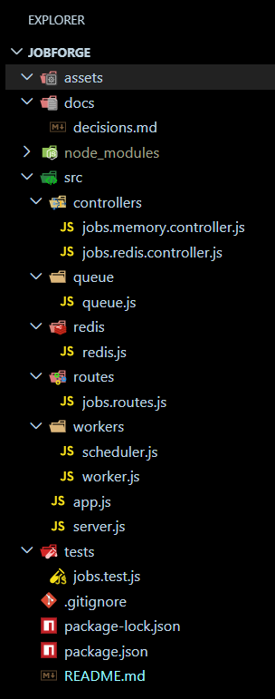 | 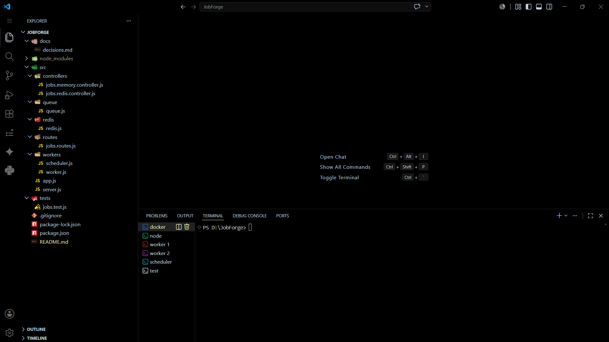 |

---

### API Endpoints

| Create Job | List Jobs |
|------------|-----------|
| 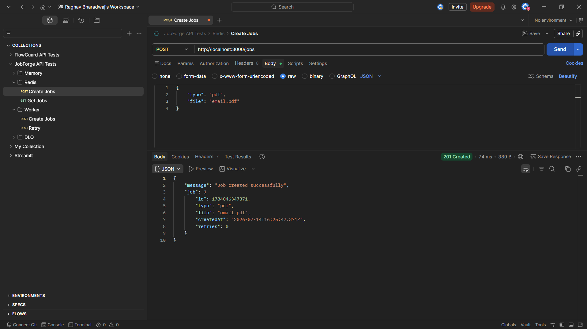 | 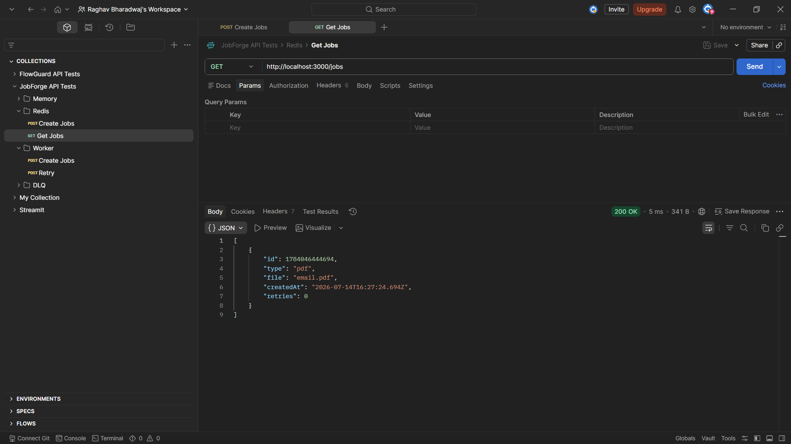 |

### Dead Letter Queue

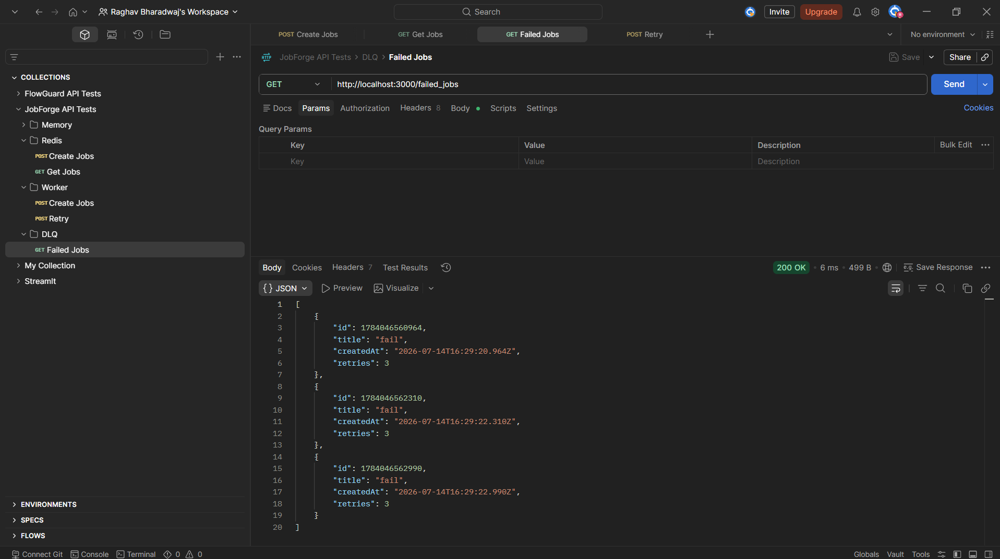

### Replay Failed Job

After resolving the underlying cause of a failure (such as a temporary service outage), an operator can replay an individual job from the Dead Letter Queue instead of recreating it manually.

<p align="center">
  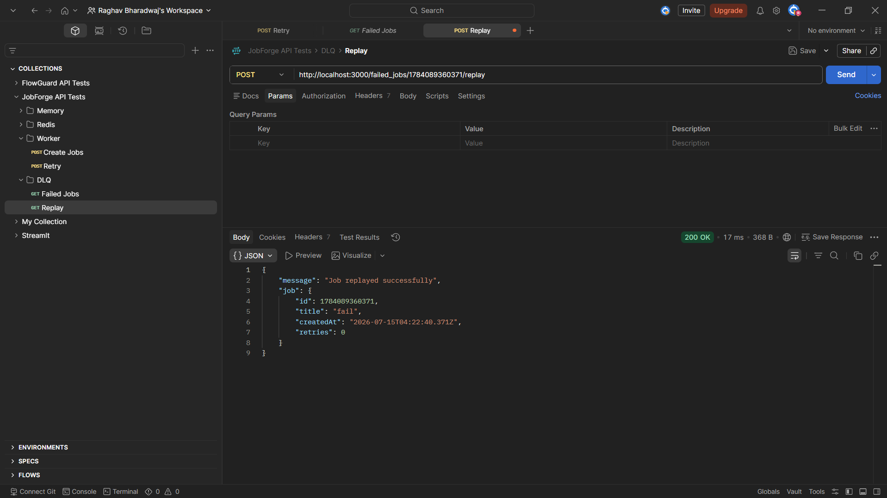
</p>

The replay endpoint removes the job from the Dead Letter Queue, resets its retry counter, and places it back into the main queue for normal processing.

<p align="center">
  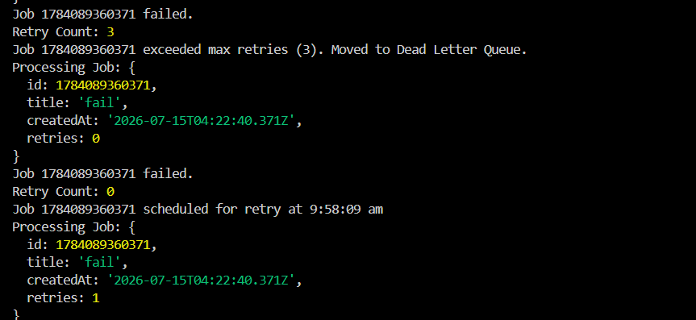
</p>

The replayed job re-enters the main queue and follows the same processing path as every newly created job. No changes to the worker logic are required because replay simply places the job back into the queue.

<p align="center">
  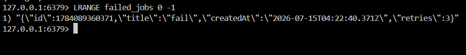
</p>

The Redis CLI shows the job stored in the Dead Letter Queue before replay, allowing operators to inspect failed jobs prior to resubmitting them for processing.

---

### Redis Data Structures

#### Main Queue (Redis List)

```bash
LRANGE jobs 0 -1
```

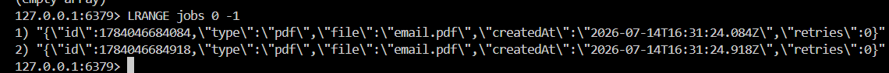

#### Delayed Queue (Redis Sorted Set)

```bash
ZRANGE delayed_jobs 0 -1 WITHSCORES
```

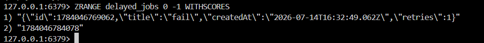

#### Dead Letter Queue

```bash
LRANGE failed_jobs 0 -1
```

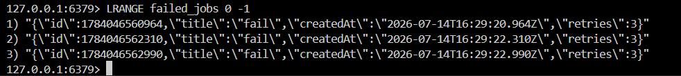

---

### Automated Tests

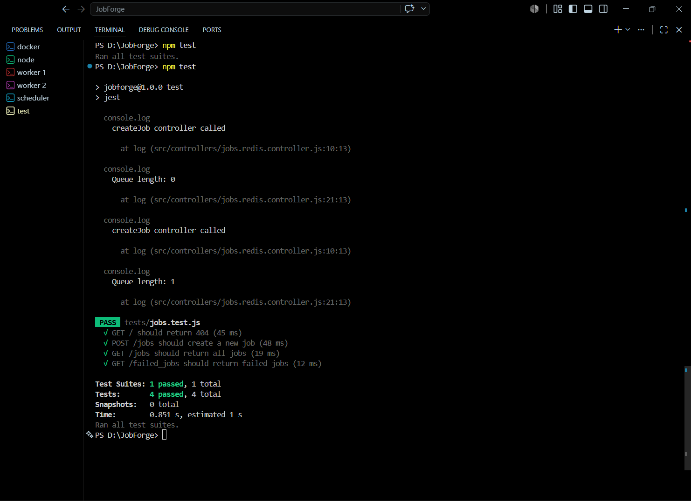

---

## Engineering Decisions

### Redis instead of an in-memory queue

The first version stored jobs in a plain JavaScript array. It worked, but lost every job on restart and couldn't be shared across processes — a worker running separately from the API had no way to see the same queue. Redis Lists fixed both problems: persistence, and a shared queue any process can read from.

### Producer–consumer separation

Jobs were initially processed inline, inside the request handler. Splitting this into an API that only creates jobs and workers that only process them keeps HTTP responses fast, and lets the two scale independently — more workers can be added without touching the API, or the reverse.

### Dedicated worker processes

Workers run as their own OS processes rather than functions called from within Express. A worker can crash or restart without taking the API down with it, and multiple workers can run side by side to process jobs concurrently.

### BRPOP instead of polling

The first worker loop called `LPOP` on a timer, checking Redis every few hundred milliseconds regardless of whether a job existed. `BRPOP` blocks until a job is actually pushed, removing the wasted round-trips entirely — the worker does nothing until there's something to do.

### Retry count travels with the job

Retry count lives on the job payload itself, not in a separate Redis key. This keeps workers stateless — any worker can continue processing any job mid-retry-cycle without needing to look up additional state elsewhere.

### Dead Letter Queue

Jobs that exceed the retry limit are moved to a separate list instead of being discarded. A queue system should never lose a job silently — a dead-lettered job is still there to inspect, debug, and eventually replay.

### Delayed retries over immediate retries

Retrying a failed job immediately tends to hit the same failure again right away, especially if the cause is a downstream outage — many jobs retrying instantly at once is a retry storm, and it makes an already-struggling dependency worse. Storing the retry on a Sorted Set, scored by when it should run, lets the system wait out the delay before trying again.

### A dedicated scheduler process

Rather than having workers sleep and wait for a retry timer, a separate scheduler process polls the delayed queue and moves due jobs back to the main queue. Workers stay simple — always processing, never waiting — and scheduling becomes its own isolated responsibility.

### Manual Replay from the Dead Letter Queue

Dead-lettered jobs are intentionally replayed through a dedicated API rather than automatically retried forever.

The replay endpoint removes the selected job from the Dead Letter Queue, resets its retry counter, and pushes it back into the main queue. Because replayed jobs follow the same execution path as newly created jobs, no additional worker logic is required.

Keeping replay as a manual operation gives operators control over when failed jobs should be retried, typically after the underlying issue has been resolved.

### Integration tests over isolated unit tests

Tests run the full request → controller → Redis → response path instead of mocking Redis out. A mocked Redis client can't confirm that the `BRPOP` logic, or the sorted-set scheduling, actually behaves correctly against real Redis.

Every feature in JobForge exists because the previous implementation exposed a limitation.

The project intentionally evolved incrementally rather than implementing the final architecture from the beginning.

---

## Benchmark Observations

These are qualitative observations from manual testing, not a formal load test:

- Job creation is effectively constant time — a single `RPUSH` regardless of queue depth.
- Workers stay idle without burning CPU while waiting, since `BRPOP` blocks instead of polling.
- Running two worker processes concurrently confirmed jobs are distributed without duplication — Redis's atomic pop means each job is claimed by exactly one worker.
- Throughput under real concurrent load hasn't been measured yet. A natural next step is firing several hundred jobs and comparing jobs/second with one worker versus two.

---

## Comparison with Production Systems

| JobForge | Production Systems |
|----------|--------------------|
| Redis Lists | Redis Streams / RabbitMQ / Kafka |
| Fixed-delay retries | Configurable policies, exponential backoff |
| Polling scheduler | Event-driven scheduling |
| No delivery acknowledgements | Acknowledgements / visibility timeouts |
| Manual Dead Letter Queue Replay | Managed DLQs with alerting |
| Learning-focused | Built for high availability |

JobForge trades production completeness for clarity on purpose — understanding these gaps was as much the point as building the queue itself.

---

## Idempotency

JobForge intentionally does **not** implement a naive Redis-only idempotency mechanism.

A common approach is to store an idempotency key before or after processing a job. While this appears to prevent duplicate execution, it still leaves an unavoidable failure window.

If a worker records completion before performing the actual work, a crash may permanently mark a job as processed even though the work never happened. If the work completes first but the worker crashes before recording completion, replaying the job may execute it again.

This is known as the **dual-write problem**. The business operation and the Redis state update occur in two independent systems and cannot be committed atomically.

Redis transactions (`MULTI/EXEC`) and Lua scripts only provide atomicity for Redis operations. They cannot include external side effects such as sending an email or calling a third-party API.

Production systems typically reduce or eliminate this risk using techniques such as delivery acknowledgements, transactional outbox patterns, or downstream systems that support idempotency keys.

Rather than presenting an incomplete solution as correct, JobForge documents this limitation and focuses on reliable retries, delayed scheduling, Dead Letter Queues, and manual replay.

---

## Limitations & Future Improvements

| Area | Current State | Planned Improvement |
|------|---------------|----------------------|
| Retry delay | Fixed delay | Exponential backoff |
| Acknowledgements | Job is popped and assumed processed | Consumer acks / visibility timeout |
| Scheduler | Single instance; read-then-remove on the Sorted Set isn't atomic | Lua script for an atomic claim |
| Worker health | No heartbeat | Heartbeat + stale job detection |
| Locking | None | Distributed locking, to run multiple schedulers safely |
| Ordering | FIFO only | Priority queues |
| Failed jobs | Manual replay supported | Bulk replay and replay filtering |
| Job control | No cancellation once queued | Job cancellation |
| Observability | Logs only | Metrics dashboard (Prometheus/Grafana) |
| Security | No authentication | Authentication & authorization |
| Deployment | Manual, one process per terminal | Docker Compose, CI/CD |
| Transport | Redis Lists/Sorted Sets | Evaluate Redis Streams |

---

## Interview Discussion Topics

**Queue design** — Why asynchronous processing? What's the producer–consumer pattern? Why Redis over an in-memory array? Why `BRPOP` instead of polling? Why separate workers from the API process?

**Reliability** — Why do retries matter, and why are immediate retries risky? What's a retry storm? Why delay retries instead of retrying right away? What's a Dead Letter Queue for?

**Redis specifics** — Why a List for the main queue but a Sorted Set for delayed jobs? What does the ZSET score represent here? Which commands does the system depend on, and why those?

**Distributed systems** — What happens if a worker crashes mid-job? What happens if the scheduler crashes? Why is idempotency difficult to implement correctly? What is the dual-write problem? Why don't Redis transactions solve it? Why are acknowledgements useful, and why doesn't this system implement them?

**Testing** — Why integration tests over unit tests here? Why Supertest? Why clear Redis before every test?

---

## Author

**Raghav Bharadwaj**

GitHub: https://github.com/Raghav-RB

Repository: https://github.com/Raghav-RB/JobForge